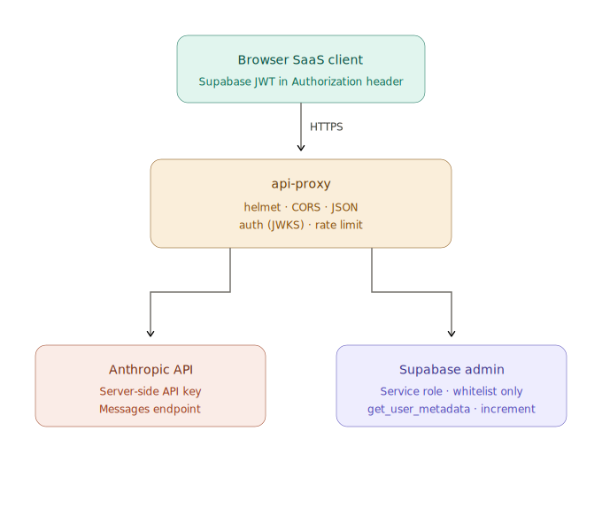

# api-proxy

A lightweight Node.js + Express proxy that holds the Anthropic API key and Supabase service-role key server-side. The browser SaaS workspace authenticates the user with Supabase, sends the resulting JWT to this proxy, and the proxy forwards approved requests to Anthropic and (whitelisted) Supabase admin operations on the user's behalf. It is stateless, per-user rate-limited, and deploys to Railway.

## Architecture



## Endpoints

All routes except `/health` require `Authorization: Bearer <supabase-jwt>`.

| Method | Path | Purpose |
| --- | --- | --- |
| `GET` | `/health` | Liveness probe. No auth. Returns `{ status, version }`. |
| `GET` | `/api/me` | Returns `{ id, email, role }` from the JWT claims. |
| `GET` | `/api/usage` | Returns `{ limit, remaining, resetAt }` for the caller's rate-limit window. |
| `POST` | `/api/anthropic/messages` | Proxies to Anthropic Messages API. Body mirrors Anthropic's spec; `stream: true` returns SSE. Client-supplied `api_key`/`apiKey` is rejected. |
| `POST` | `/api/supabase/query` | Whitelisted server-side Supabase ops. Body: `{ operation, params }`. Supported ops: `get_user_metadata`, `increment_user_credit`. |

## Authentication

Every protected request must carry the Supabase access token issued to the signed-in user:

```http
GET /api/me HTTP/1.1
Host: api.example.com
Authorization: Bearer <supabase-access-token>
```

In a Supabase JS client app:

```js
const { data: { session } } = await supabase.auth.getSession();
const res = await fetch(`${API_URL}/api/me`, {
  headers: { Authorization: `Bearer ${session.access_token}` },
});
```

Tokens are verified locally against the project's JWKS via `supabase.auth.getClaims()`. The proxy falls back to `supabase.auth.getUser()` only when `SUPABASE_JWT_SECRET` is set (legacy HS256 projects). On any verification failure the request is rejected with `401`.

## Rate limiting

Defaults (set in `.env`):

```
RATE_LIMIT_WINDOW_MS=60000   # 1-minute window
RATE_LIMIT_MAX=30            # 30 requests per window per user
```

The limiter keys on the Supabase user `sub` claim — never on IP. When the cap is hit the proxy responds `429 { error: 'rate_limited', retryAfterMs }` and emits draft-7 `RateLimit` / `RateLimit-Policy` headers on every response. Tune the two env vars to match your plan; the in-memory store is per-instance, so the effective ceiling is `replicas × RATE_LIMIT_MAX`.

## Local development

```bash
git clone <repo-url>
cd api-proxy
npm install
cp .env.example .env
# fill in ANTHROPIC_API_KEY, SUPABASE_URL, SUPABASE_SERVICE_ROLE_KEY,
# ALLOWED_ORIGINS, and (optionally) SUPABASE_JWT_SECRET
npm run dev
```

Useful scripts:

```bash
npm run dev      # node --watch src/index.js
npm test         # vitest run
npm run test:watch
npm run lint
npm run format
```

The server listens on `PORT` (default `3000`). Hit `http://localhost:3000/health` to verify.

## Deployment (Railway)

1. **Create the project.** In the Railway dashboard click *New Project → Deploy from GitHub repo* and pick this repository. Railway detects Node 20 from `package.json` and uses the build/start config in `railway.json`.
2. **Set environment variables** on the service. The keys marked **SEAL** must use Railway's "Sealed Variables" so they are never visible after creation:

   | Variable | Sealed? | Notes |
   | --- | --- | --- |
   | `NODE_ENV` | no | `production` |
   | `LOG_LEVEL` | no | `info` is a sensible default |
   | `ANTHROPIC_API_KEY` | **SEAL** | from console.anthropic.com → API Keys |
   | `SUPABASE_URL` | no | public project URL |
   | `SUPABASE_SERVICE_ROLE_KEY` | **SEAL** | Supabase → Project Settings → API |
   | `SUPABASE_JWT_SECRET` | **SEAL** | only if your project still uses legacy HS256 keys |
   | `ALLOWED_ORIGINS` | no | comma-separated list of frontend origins (no wildcard) |
   | `RATE_LIMIT_WINDOW_MS` | no | optional override (default `60000`) |
   | `RATE_LIMIT_MAX` | no | optional override (default `30`) |

   Do **not** set `PORT`; Railway injects it.

3. **Generate a domain.** *Settings → Networking → Generate Domain* (or attach a custom domain). Copy the resulting URL.
4. **Point the frontend at it.** Update the SaaS client to call this URL for proxied requests, and add the frontend's origin(s) (e.g. `https://app.example.com,https://staging.example.com`) to `ALLOWED_ORIGINS`. Redeploy.
5. **Verify.** `curl https://<domain>/health` should return `{ "status": "ok", "version": "..." }`. Railway's healthcheck (configured in `railway.json`) calls the same endpoint and restarts the container on failure.

## Rotating keys

Both rotations are zero-downtime if you swap the env var before revoking the old credential.

**Anthropic API key**
1. Console → *Account → API Keys* → create a new key.
2. In Railway, update the sealed `ANTHROPIC_API_KEY` to the new value and redeploy.
3. Confirm `/api/anthropic/messages` still works (a single authenticated request from the client is enough).
4. Revoke the old key in the Anthropic console.

**Supabase service-role key**
1. Supabase → *Project Settings → API* → *Generate new service_role secret*. Supabase keeps the previous key valid for a short grace window.
2. Update the sealed `SUPABASE_SERVICE_ROLE_KEY` in Railway and redeploy.
3. Verify `/api/supabase/query` still works (e.g. `get_user_metadata`).
4. Once confirmed, revoke the prior key in the Supabase dashboard.

If you suspect a leak, do it the other way around — revoke first, accept brief downtime — and audit access logs.

## Future work

- **Swap the rate-limit store to Redis.** The current `MemoryStore` is per-instance, so horizontal scaling on Railway dilutes the cap. The swap recipe (`rate-limit-redis` + `ioredis`) is documented at the top of [`src/middleware/rateLimit.js`](./src/middleware/rateLimit.js).
- **Request-cost tracking.** The route already logs `inputTokens` / `outputTokens` per call; the next step is to persist those to Supabase (or a metrics sink) so we can attribute spend per user and per model.
- **Per-user monthly budgets.** Layer a soft cap on top of the rate limiter — e.g. block calls when a user crosses their monthly cost ceiling and surface the remaining budget through `/api/usage`.
